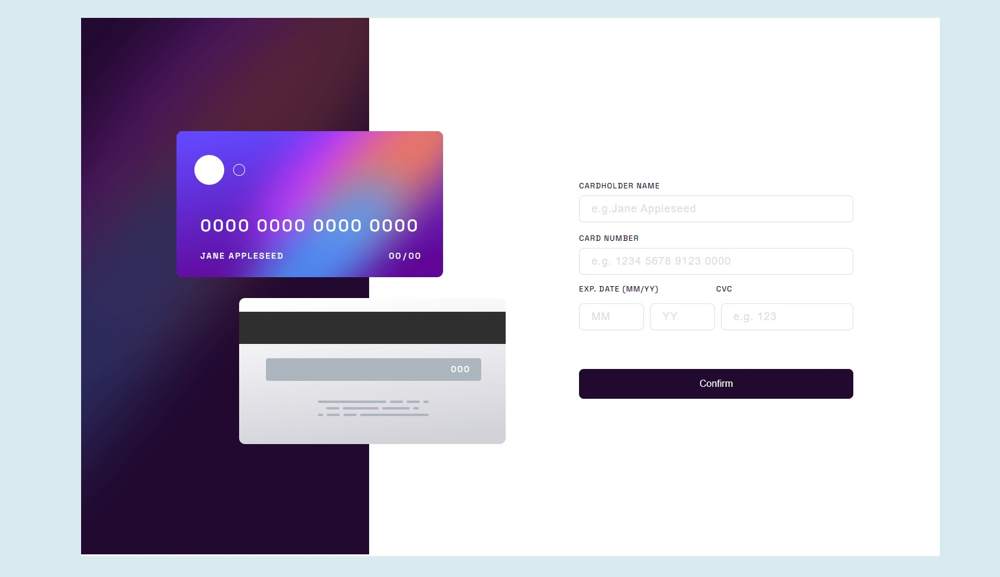
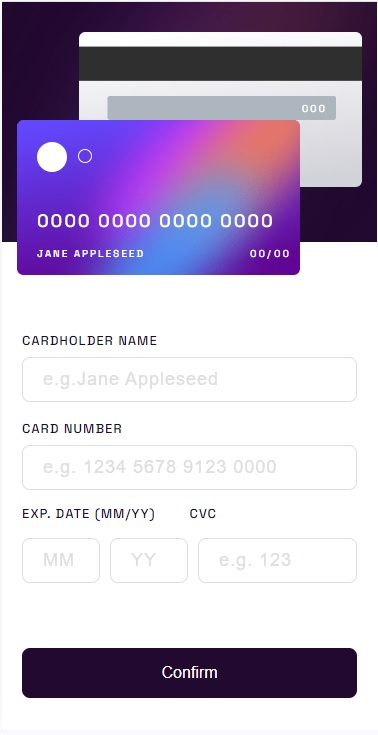

# Frontend Mentor - Interactive card details form solution

## Table of contents

- [Overview](#overview)
  - [The challenge](#the-challenge)
  - [Screenshot](#screenshot)
  - [Links](#links)
- [My process](#my-process)
  - [Built with](#built-with)
  - [What I learned](#what-i-learned)
  - [Continued development](#continued-development)
- [Author](#author)

## Overview

### The challenge

Users should be able to:

- Fill in the form and see the card details update in real-time
- Receive error messages when the form is submitted if:
  - Any input field is empty
  - The card number, expiry date, or CVC fields are in the wrong format
- View the optimal layout depending on their device's screen size
- See hover, active, and focus states for interactive elements on the page

### Screenshot

### Links

- Live Site URL: [Add live site URL here](https://your-live-site-url.com)

## My process

### Built with

- Semantic HTML5 markup
- CSS custom properties
- JavaScript
- Flexbox
- Mobile-first workflow

### What I learned

This project helped me to understand and learn about how to validate forms.

### Continued development

After doing this project, I came to the conclusion that I need to spend more time learning JavaScript, keep learning how to make my code clearer and easier to read.

## Author

- [@mslysz](https://mslysz.github.io/My-gh-pages/third-page/)
